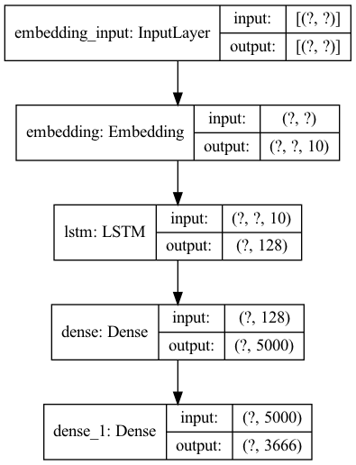

    </a>&nbsp
    </a>&nbsp
    

* * *
### 해외 축구 기사 자동 생성 
### 기사를 분석한 뒤 한 키워드를 입력하면 그 키워드에 대한 기사를 자동 생성한다.
* * *
## 과정
1.	2004.05.10 ~ 2022.05.10까지의 네이버 해외 축구 기사를 크롤링하여 학습 데이터를 모은다.
2.	46,030개의 데이터를 전처리하여 리스트에 저장한다.
3.	각 문장의 형태소를 분석하고 각 단어에 고유한 정수를 부여한다.
4.	컴퓨터가 텍스트를 숫자로 처리할 수 있도록 각 문장에 있는 단어들을 정수로 고치는 동시에 하나의 문장을 여러 줄로 분해하여 훈련 데이터를 구성한다.
5.	패딩 작업을 통하여 맨 우측에 있는 단어만 따로 y 레이블로 분리한다.
6.	Y 레이블에 대해서 원-핫 인코딩을 수행한다.
7.	LSTM을 이용한 인공지능 모델을 구성하여 학습시킨다.
8.	입력한 키워드에 대해서 예측한 단어를 조합해 문장을 완성한다.

* * *
## 모델 구성

* * *
## 한계
### 키워드를 한 개밖에 설정할 수 없으며 생성된 기사가 학습된 기사와 유사하게 나타난다,또한 학습된 모델의 정확도가 85%이며 문장의 형태가 자연스럽지 않은 문제점들이 있어 후속 연구로 완성도를 높일 계획이다.
